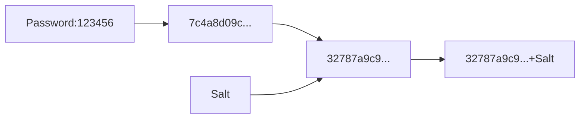

The salted password is used to encrypt the user password. In order to prevent the encrypted password from being guessed,
the Salt processing is added after the encrypted password, so that the same password will generate a different encrypted
content each time

## How does it work
The plain text password is hashed by SHA-256. Then we add a salt to the password and hash it again. This salt will be at the front of the hash.



## How to use
Add nuget reference
```
PM> Install-Package Doulex.SaltedPassword
```

add these code to your project

```C#
// Encrypt the password
var saltedPassword = new SaltedPassword();
var encryption     = saltedPassword.CreatePassword("ThisIsThePassword");

// Verify the password
var result = saltedPassword.VerifyPassword("ThisIsThePassword", encryption);
```
