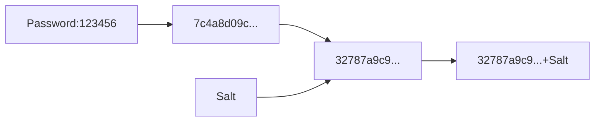

Salted password is a good library to hash and verify passwords. 

## How does it work
The plain text password is hashed by SHA-256. Then we add a salt to the password and hash it again. This salt will be at the front of the hash.



## Installing
First, add the Doulex.SaltedPassword library to your project:

```
PM> Install-Package Doulex.SaltedPassword
```

## Usage

Create SaltedPassword object and use it to hash and verify password.

```csharp
// Encrypt the password
var saltedPassword = new SaltedPassword();
var encryption     = saltedPassword.CreatePassword("ThisIsThePassword");

// Verify the password
var result = saltedPassword.VerifyPassword("ThisIsThePassword", encryption);
```
